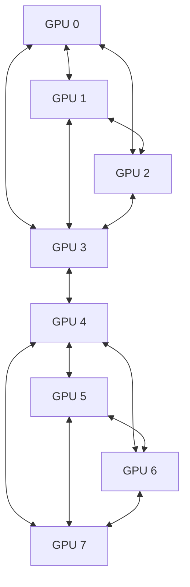

# Implementation Plan: P2P GPU Communication and CPU/RAM Optimization for ExLlamaV3

## Executive Summary

This plan outlines the implementation of peer-to-peer (P2P) GPU communication and optimization of CPU/RAM-bound operations to significantly improve token generation speed in ExLlamaV3, particularly for tensor parallelism scenarios with multiple GPUs (e.g., 8 GPUs with fast P2P access).

## Current State Analysis

### Existing Tensor Parallelism Implementation
- **Process-based Architecture**: Each GPU runs in a separate process with dedicated CUDA contexts
- **Communication Backends**: 
  - NCCL (NVIDIA Collective Communications Library)
  - Native implementation using shared memory and CUDA kernels
- **Memory Management**: Host-registered shared memory buffers (16MB default)
- **Communication Patterns**: Ring-based all-reduce, broadcast, and gather operations

### Identified Bottlenecks
1. **CPU/RAM-bound Operations**:
   - Inter-process communication overhead
   - Process spawning and management
   - Serialization/deserialization of tensors
   - Host memory registration/unregistration
   - CPU-based reduction operations

2. **GPU Communication Limitations**:
   - Ring-based communication requiring (N-1) iterations for N GPUs
   - All inter-GPU communication goes through host memory
   - No direct GPU-to-GPU memory access
   - Multiple synchronization points per operation

## Architecture Design for P2P GPU Communication

### 1. Direct GPU-to-GPU Memory Access

#### NVLink/PCIe P2P Implementation


**Key Components**:
- **P2P Memory Manager**: Handles direct GPU memory access between devices
- **Topology Discovery**: Automatically detects P2P capabilities and optimal communication paths
- **Memory Registration Pool**: Pre-registered GPU memory regions for fast access

#### Implementation Strategy
1. **CUDA P2P API Integration**:
   - Use `cudaDeviceEnablePeerAccess()` for direct GPU memory access
   - Implement `cudaMemcpyPeerAsync()` for asynchronous transfers
   - Handle topology detection with `cudaDeviceCanAccessPeer()`

2. **Communication Pattern Optimization**:
   - Replace ring-based all-reduce with tree-based reduction
   - Implement direct broadcast for multi-GPU scenarios
   - Optimize gather operations with direct memory access

### 2. Tree-based Reduction Architecture


**Benefits**:
- Reduces communication steps from O(N) to O(log N)
- Better scalability with increasing GPU count
- Reduced synchronization overhead

### 3. Asynchronous Communication Pipeline


**Implementation**:
- Overlap computation with communication
- Pipeline parallelism for data transfers
- Reduce synchronization points

## CPU/RAM Optimization Strategies

### 1. Process Management Optimization

#### Thread-based Parallelism for Select Operations
- Replace process-based architecture for certain operations
- Reduce inter-process communication overhead
- Implement shared memory spaces for frequent operations

#### Optimized Message Passing
- Binary protocol for tensor serialization
- Zero-copy message passing where possible
- Batched message processing

### 2. Memory Efficiency Improvements

#### Tensor Serialization Optimization
- Custom binary format for tensor data
- Eliminate redundant metadata
- Compress tensor data where appropriate

#### Cache Utilization Patterns
- Implement intelligent cache prefetching
- Optimize memory access patterns
- Reduce memory fragmentation

### 3. Shared Memory Enhancements

#### Dynamic Buffer Sizing
- Adaptive buffer sizing based on workload
- Reduce memory waste for small operations
- Increase throughput for large operations

#### Memory Pool Management
- Pre-allocated memory pools for frequent operations
- Zero-copy memory sharing where possible
- Efficient memory allocation/deallocation

## Integration Approach with Existing Codebase

### 1. Backend Architecture Extension

#### New P2P Backend Class
```python
class TPBackendP2P(TPBackend):
    def __init__(self, device, active_devices, output_device, init_method, master, uuid):
        # Initialize P2P capabilities
        # Discover topology
        # Setup memory pools
    
    def broadcast(self, tensor, src_device):
        # Direct GPU-to-GPU broadcast
        pass
    
    def all_reduce(self, tensor, contribution=True):
        # Tree-based reduction with P2P
        pass
    
    def gather(self, tensor, out_tensor, gather_devices, out_device, ldims):
        # Optimized gather with direct memory access
        pass
```

#### Hybrid Backend Strategy
- Maintain compatibility with existing NCCL and Native backends
- Automatic backend selection based on hardware capabilities
- Fallback mechanisms for unsupported operations

### 2. Memory Management Integration

#### Enhanced SMProducer/SMConsumer
- Add P2P memory sharing capabilities
- Implement direct GPU memory access
- Optimize buffer management

#### CUDA Extensions Enhancement
- New P2P communication kernels
- Optimized reduction operations
- Asynchronous communication primitives

### 3. API Compatibility

#### Backward Compatibility
- Maintain existing API interfaces
- Transparent backend selection
- Gradual migration path

#### Configuration Options
- New P2P-specific configuration parameters
- Performance tuning options
- Debugging and profiling tools

## Implementation Phases and Priorities

### Phase 1: Foundation (High Priority)
1. **P2P Capability Detection**
   - Implement topology discovery
   - Test P2P access between GPUs
   - Create compatibility matrix

2. **Basic P2P Memory Operations**
   - Direct memory read/write between GPUs
   - Asynchronous memory transfer
   - Error handling and recovery

3. **Tree-based Reduction Prototype**
   - Implement basic tree reduction
   - Performance benchmarking
   - Comparison with existing ring-based approach

### Phase 2: Core Implementation (High Priority)
1. **P2P Backend Implementation**
   - Complete TPBackendP2P class
   - Integration with existing tensor parallelism
   - Comprehensive testing

2. **Memory Pool Management**
   - GPU memory pool allocation
   - Dynamic buffer sizing
   - Memory efficiency optimization

3. **Asynchronous Communication**
   - Pipeline parallelism implementation
   - Overlap computation and communication
   - Synchronization optimization

### Phase 3: Optimization (Medium Priority)
1. **CPU/RAM Optimization**
   - Process management improvements
   - Message passing optimization
   - Cache utilization enhancement

2. **Performance Tuning**
   - Adaptive algorithm selection
   - Workload-specific optimizations
   - Dynamic parameter adjustment

3. **Advanced Features**
   - Multi-level communication hierarchy
   - Hybrid communication patterns
   - Fault tolerance and recovery

### Phase 4: Integration and Testing (Medium Priority)
1. **Comprehensive Testing**
   - Multi-GPU scalability testing
   - Performance regression testing
   - Compatibility testing

2. **Documentation and Tools**
   - Performance profiling tools
   - Debugging utilities
   - Configuration guides

3. **Production Deployment**
   - Stability testing
   - Performance validation
   - User documentation

## Performance Optimization Techniques

### 1. Communication Pattern Optimization

#### Adaptive Topology Selection
```python
def select_optimal_topology(gpu_topology, operation_type):
    if operation_type == "all_reduce":
        if gpu_topology.is_fully_connected():
            return "tree_based"
        else:
            return "ring_based"
    elif operation_type == "broadcast":
        if gpu_topology.has_central_hub():
            return "hub_based"
        else:
            return "p2p_chain"
```

#### Dynamic Buffer Sizing
```python
def calculate_optimal_buffer_size(tensor_size, gpu_count, operation_type):
    base_size = tensor_size * gpu_count
    if operation_type == "all_reduce":
        return base_size * 1.5  # Extra space for reduction
    elif operation_type == "broadcast":
        return base_size * 1.2  # Small overhead for broadcast
    else:
        return base_size
```

### 2. Memory Access Optimization

#### Cache-Friendly Access Patterns
- Optimize memory access for GPU cache utilization
- Implement memory coalescing for better bandwidth
- Reduce memory bank conflicts

#### Zero-Copy Operations
- Minimize memory copies between CPU and GPU
- Use unified memory where appropriate
- Implement direct GPU-to-GPU transfers

### 3. Computation-Communication Overlap

#### Pipeline Parallelism
```python
async def overlapped_operation():
    # Start communication
    comm_future = start_communication()
    
    # Perform computation while communication progresses
    result = perform_computation()
    
    # Wait for communication to complete
    await comm_future
    
    return combine_results(result, comm_result)
```

#### Predictive Prefetching
- Anticipate future communication needs
- Prefetch data before it's needed
- Hide communication latency

## Expected Performance Improvements

### 1. Token Generation Speed
- **Target**: 20-30% improvement in tokens/second
- **First Token Latency**: 15-25% reduction
- **Scalability**: Better performance scaling with GPU count

### 2. Memory Efficiency
- **CPU/RAM Usage**: 20-30% reduction for communication buffers
- **GPU Memory**: Better utilization with P2P access
- **Memory Bandwidth**: Higher effective bandwidth utilization

### 3. Communication Overhead
- **Synchronization**: 40-50% reduction in synchronization time
- **Data Transfer**: Direct GPU-to-GPU transfers eliminate host memory bottleneck
- **Scalability**: O(log N) instead of O(N) communication complexity

## Risk Assessment and Mitigation

### 1. Technical Risks
- **P2P Compatibility**: Not all GPU combinations support P2P
  - *Mitigation*: Fallback to existing communication methods
- **Memory Coherency**: Ensuring data consistency across GPU memory spaces
  - *Mitigation*: Robust synchronization mechanisms and testing
- **Performance Regression**: New implementation might be slower in some scenarios
  - *Mitigation*: Comprehensive benchmarking and adaptive algorithm selection

### 2. Implementation Risks
- **Complexity**: P2P implementation adds significant complexity
  - *Mitigation*: Incremental implementation with thorough testing
- **Debugging**: P2P issues can be difficult to diagnose
  - *Mitigation*: Extensive logging and debugging tools
- **Compatibility**: New features might break existing functionality
  - *Mitigation*: Maintain backward compatibility and comprehensive testing

## Success Metrics

### 1. Performance Metrics
- Token generation throughput (tokens/second)
- First token latency
- GPU utilization efficiency
- Memory bandwidth utilization
- Communication overhead reduction

### 2. Stability Metrics
- System stability under load
- Error rates and recovery success
- Compatibility across different GPU configurations
- Resource utilization efficiency

### 3. Scalability Metrics
- Performance scaling with GPU count
- Memory usage scaling
- Communication efficiency scaling
- Overall system throughput scaling

## Conclusion

This implementation plan provides a comprehensive approach to optimizing ExLlamaV3's tensor parallelism through P2P GPU communication and CPU/RAM optimization. The phased approach ensures manageable implementation while delivering significant performance improvements. The expected 20-30% improvement in token generation speed, combined with better scalability and resource utilization, will substantially enhance the system's capabilities for multi-GPU deployments.